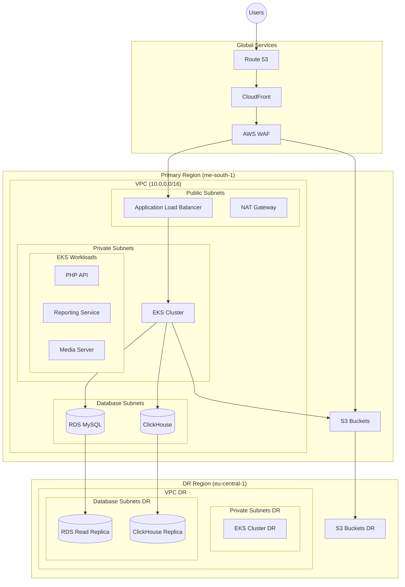

# Deliverables
- ## Task 1
    - [Task 1(A)](#architecture-diagram----knowledgecity-platform)
    - [Task 1(B)](#aws-infrastructure-design-documentation---knowledgecity-platform)
- ## Task 2
    - [Task 2](terraform/main.tf)
- ## Task 3
    - [Task 3](.github/workflows)

# Architecture Diagram  - KnowledgeCity Platform



# AWS Infrastructure Design Documentation - KnowledgeCity Platform
## Table of Contents

- [Design Overview](#Design-overview)
- [High Availability Architecture](#high-availability-architecture)
- [Security Implementation](#security-implementation)
- [Performance Optimization](#performance-optimization)
- [Cost Considerations](#cost-considerations)

## Design Overview
The infrastructure is designed to host KnowledgeCity's learning platform, supporting multiple front-end applications, APIs, and media services. The architecture leverages AWS's global infrastructure with primary deployment in Bahrain (me-south-1) and disaster recovery in Frankfurt (eu-central-1).
### Key Components
```hcl
# Primary VPC Configuration
module "vpc" {
  source = "./modules/vpc"
  
  cidr = "10.0.0.0/16"
  azs  = ["me-south-1a", "me-south-1b", "me-south-1c"]
  
  private_subnets  = ["10.0.1.0/24", "10.0.2.0/24", "10.0.3.0/24"]
  database_subnets = ["10.0.4.0/24", "10.0.5.0/24", "10.0.6.0/24"]
  public_subnets   = ["10.0.7.0/24", "10.0.8.0/24", "10.0.9.0/24"]
  
  enable_nat_gateway     = true
  single_nat_gateway     = false
  one_nat_gateway_per_az = true
}
```
## High Availability Architecture
### Multi-AZ EKS Deployment
```hcl
module "eks" {
  source          = "./modules/eks"
  cluster_name    = "knowledgecity-prod"
  cluster_version = "1.28"
  
  vpc_id          = module.vpc.vpc_id
  subnet_ids      = module.vpc.private_subnets
  
  node_groups = {
    critical = {
      desired_capacity = 2
      max_capacity     = 4
      min_capacity     = 2
      instance_types   = ["t3.large"]
      
      labels = {
        criticality = "high"
      }
    }
  }
}
```
### Database Resilience
```hcl
resource "aws_db_instance" "main" {
  identifier        = "knowledgecity-prod"
  engine           = "mysql"
  engine_version   = "8.0"
  instance_class   = "db.t3.large"
  
  multi_az         = true
  backup_retention_period = 7
  
  storage_encrypted = true
  storage_type      = "gp3"
  allocated_storage = 100
  
  db_subnet_group_name   = aws_db_subnet_group.main.name
  vpc_security_group_ids = [aws_security_group.rds.id]
}
```
### Cross-Region Replication
```hcl
resource "aws_db_instance" "replica" {
  provider          = aws.frankfurt
  identifier        = "knowledgecity-dr"
  instance_class    = "db.t3.large"
  replicate_source_db = aws_db_instance.main.arn
  
  auto_minor_version_upgrade = true
  multi_az                  = false
}
```
## Security Implementation
### Network Security
```hcl
resource "aws_security_group" "api" {
  name        = "api-security-group"
  description = "Security group for API servers"
  vpc_id      = module.vpc.vpc_id

  ingress {
    from_port       = 443
    to_port         = 443
    protocol        = "tcp"
    security_groups = [aws_security_group.alb.id]
  }

  egress {
    from_port   = 0
    to_port     = 0
    protocol    = "-1"
    cidr_blocks = ["0.0.0.0/0"]
  }
}

### WAF Configuration
resource "aws_wafv2_web_acl" "main" {
  name        = "knowledgecity-waf"
  description = "WAF rules for API and CloudFront"
  scope       = "REGIONAL"

  default_action {
    allow {}
  }

  rule {
    name     = "AWSManagedRulesCommonRuleSet"
    priority = 1

    override_action {
      none {}
    }

    statement {
      managed_rule_group_statement {
        name        = "AWSManagedRulesCommonRuleSet"
        vendor_name = "AWS"
      }
    }
  }
}
```

### Data Encryption
```hcl
resource "aws_kms_key" "main" {
  description             = "KMS key for data encryption"
  deletion_window_in_days = 7
  enable_key_rotation     = true
  
  policy = jsonencode({
    Version = "2012-10-17"
    Statement = [
      {
        Sid    = "Enable IAM User Permissions"
        Effect = "Allow"
        Principal = {
          AWS = "arn:aws:iam::${data.aws_caller_identity.current.account_id}:root"
        }
        Action   = "kms:*"
        Resource = "*"
      }
    ]
  })
}
```
## Performance Optimization
### CloudFront Distribution
```hcl
resource "aws_cloudfront_distribution" "main" {
  enabled             = true
  is_ipv6_enabled     = true
  price_class         = "PriceClass_200"
  
  origin {
    domain_name = aws_s3_bucket.content.bucket_regional_domain_name
    origin_id   = "S3-${aws_s3_bucket.content.id}"
    
    s3_origin_config {
      origin_access_identity = aws_cloudfront_origin_access_identity.main.cloudfront_access_identity_path
    }
  }
  
  default_cache_behavior {
    allowed_methods  = ["GET", "HEAD", "OPTIONS"]
    cached_methods   = ["GET", "HEAD"]
    target_origin_id = "S3-${aws_s3_bucket.content.id}"
    
    forwarded_values {
      query_string = false
      cookies {
        forward = "none"
      }
    }
    
    viewer_protocol_policy = "redirect-to-https"
    min_ttl                = 0
    default_ttl            = 3600
    max_ttl                = 86400
  }
}
```
### Application Scaling
```hcl
resource "kubernetes_horizontal_pod_autoscaler_v2" "api" {
  metadata {
    name = "api-hpa"
  }
  
  spec {
    scale_target_ref {
      api_version = "apps/v1"
      kind        = "Deployment"
      name        = "api"
    }
    
    min_replicas = 2
    max_replicas = 10
    
    metric {
      type = "Resource"
      resource {
        name = "cpu"
        target {
          type                = "Utilization"
          average_utilization = 70
        }
      }
    }
  }
}
```
### Cost Considerations
The infrastructure is designed to optimize costs while maintaining high availability and performance:

EKS node groups utilize a mix of On-Demand and Spot instances
Multi-AZ deployments only in production environment
S3 lifecycle policies for cost-effective storage management
CloudFront price class optimization for target markets

### Estimated Monthly Costs
```
Production Environment:
- EKS Cluster: $283-563
- RDS (Multi-AZ): $323
- S3 + CloudFront: $160
- Network Transfer: $150

DR Environment:
- EKS (Reduced capacity): $143
- RDS Replica: $156
- S3 Cross-Region: $100

Total Estimated Cost: $1,315-1,595/month
Annual Cost: ~$15,465.60 - $18,825.60/year
```

This architecture successfully meets the requirements for:

- High availability (99.99% uptime)
- Secure data handling and transmission
- Optimized performance for global content delivery
- Cost-effective infrastructure within the $16K monthly budget
